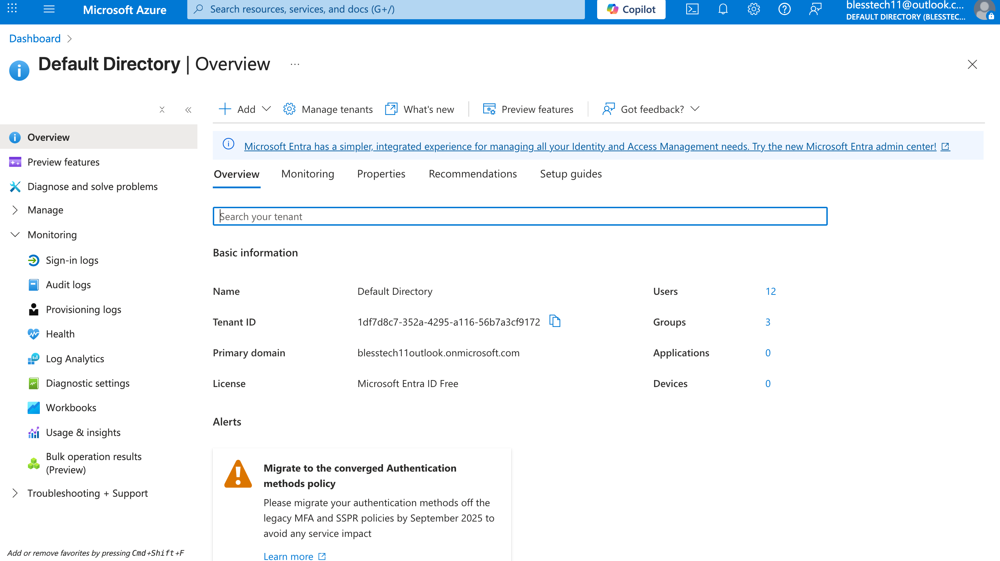
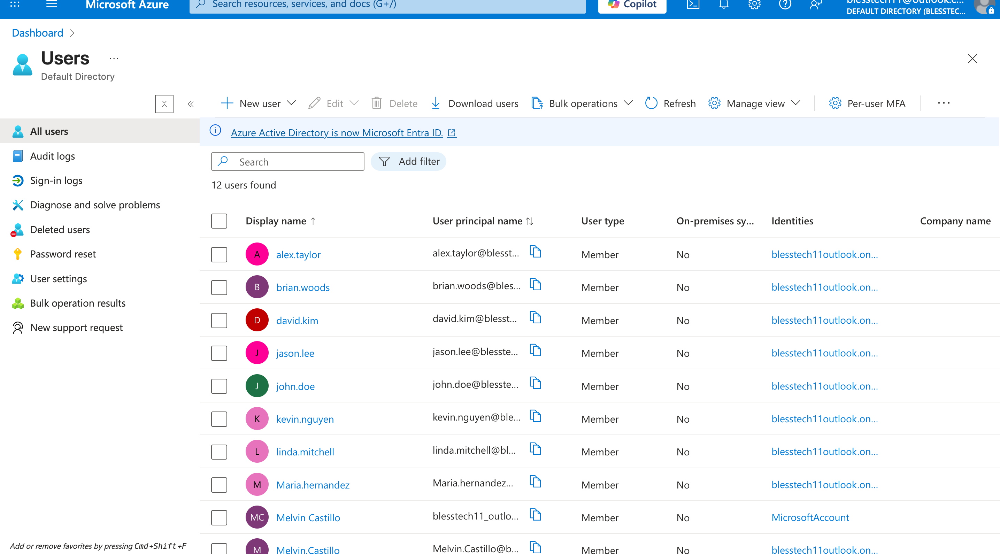
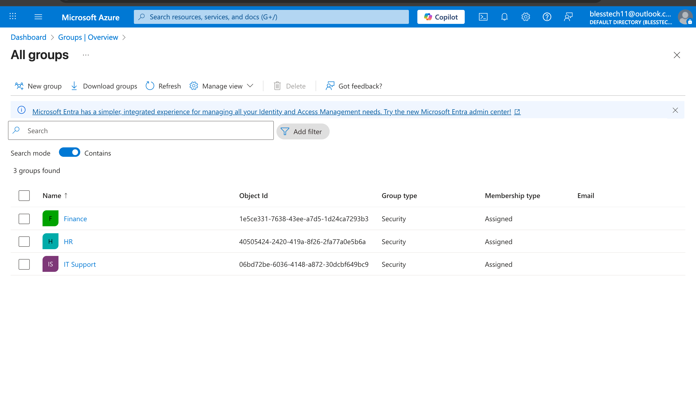
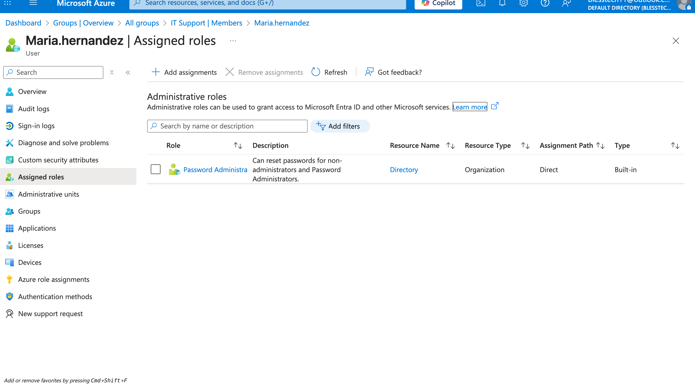
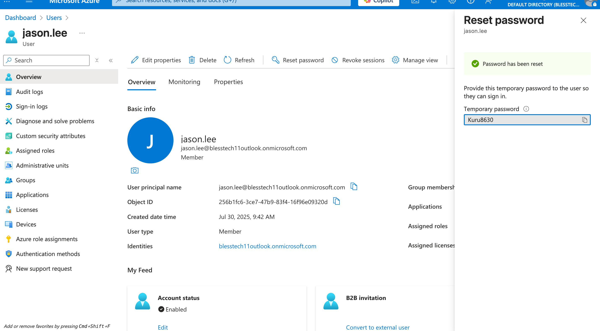
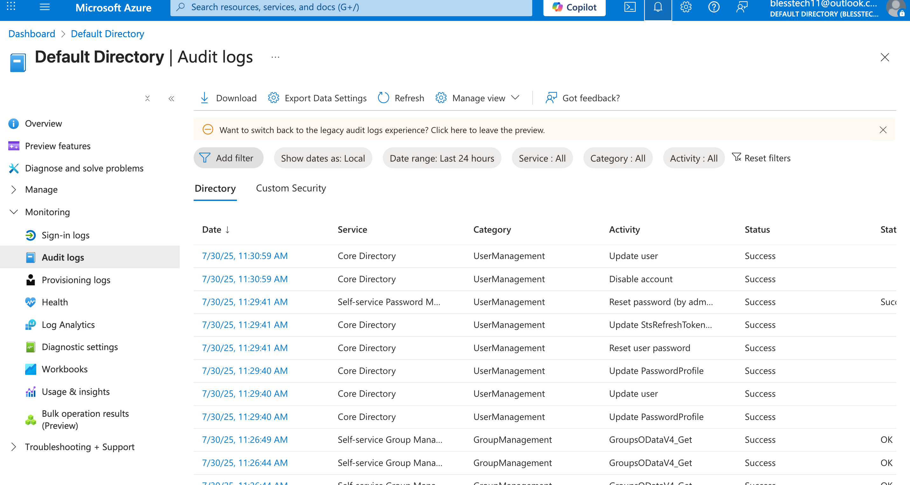

# AzureAD-UserGroup-Management
Azure project for IT help desk showcasing cloud-based identity and user management.
# 💼 Azure Active Directory – User & Group Management (Microsoft Entra ID)

## 🧰 Tools Used
- Azure Portal (Free Tier)
- Microsoft Entra ID (formerly Azure Active Directory)
- PowerShell (for optional bulk user creation)
- GitHub for documentation

---

## 📌 Project Overview

This project simulates a real-world cloud-based identity and access management scenario using Microsoft Entra ID. I created users, assigned them to departmental security groups, and configured directory roles that reflect common IT Help Desk responsibilities.

It demonstrates my hands-on knowledge of user provisioning, access management, and directory role assignments in a modern IT environment.

---

## 🧑‍💻 Users Created

| Name               | Department        | Email                                  | Role Assigned              |
|--------------------|-------------------|----------------------------------------|----------------------------|
| Maria Hernandez    | IT Support        | maria.hernandez@yourdomain.onmicrosoft.com | Password Administrator     |
| Jason Lee          | IT Support        | jason.lee@yourdomain.onmicrosoft.com   | None                       |
| Kevin Nguyen       | IT Support        | kevin.nguyen@yourdomain.onmicrosoft.com| None                       |
| Sarah Jones        | HR                | sarah.jones@yourdomain.onmicrosoft.com | User Administrator         |
| Linda Mitchell     | HR                | linda.mitchell@yourdomain.onmicrosoft.com | None                   |
| David Kim          | Finance           | david.kim@yourdomain.onmicrosoft.com   | None                       |
| Monica Ali         | Finance           | monica.ali@yourdomain.onmicrosoft.com  | None                       |
| Alex Taylor        | General Staff     | alex.taylor@yourdomain.onmicrosoft.com | None                       |
| Brian Woods        | General Staff     | brian.woods@yourdomain.onmicrosoft.com | None                       |
| Melvin Castillo    | Admin             | melvin.castillo@yourdomain.onmicrosoft.com | Global Administrator    |

---

## 🏷️ Groups Created

- IT Support  
- HR  
- Finance  

Users were assigned to their respective groups based on department roles.

---

## ✅ Tasks Completed

- [x] Created 12 user accounts
- [x] Created and managed security groups
- [x] Assigned users to groups
- [x] Assigned directory roles to simulate real IT scenarios
- [x] Performed key support tasks:
  - Reset a user password
  - Disabled a user account
  - Viewed sign-in and audit logs

---

## 💻 PowerShell Script (Optional)

A PowerShell script was used to automate user creation in Azure AD.  
See [`Create-AzureADUsers.ps1`](./Create-AzureADUsers.ps1)

---

## 🖼️ Screenshots

| Task                                | Screenshot Example                  |
|-------------------------------------|-------------------------------------|
| Microsoft Entra ID dashboard        |  |
| All users list                      |  |
| Group membership                    |  |
| Role assignment                     |  |
| Password reset confirmation         |  |
| Audit logs                          |  |

---

## 🧠 What I Learned

- How to manage cloud identities using Microsoft Entra ID
- How directory roles support principle of least privilege
- How to simulate IT help desk scenarios in the cloud

---

## 🚀 Future Improvements

- Automate group assignment via PowerShell
- Link Microsoft 365 licenses to users
- Deploy conditional access policies

---

## 📎 Project Folder Structure

